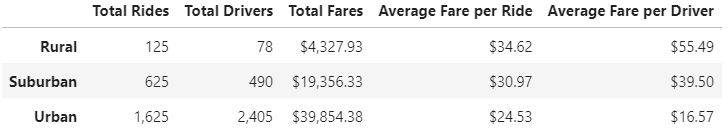
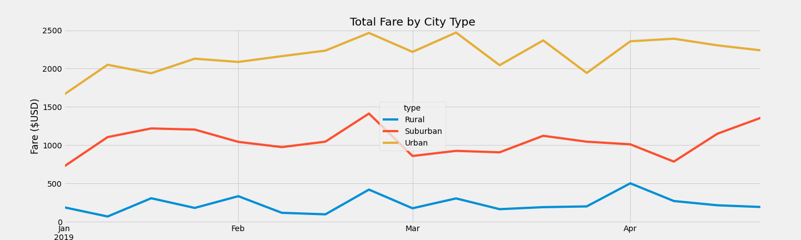

# PyBer Ride-share Analysis
## Overview
### The CEO of a large ride-share company, PyBer, has asked for a summary of ride-share data by city type. The differences between city types will be used by decision-makers for future fund and resource allocations to areas that need it most.
The summaries by city type (Rural, Suburban, Urban) include:

- Total Rides
- Total Drivers
- Total Fares
- Average Fare per Ride
- Average Fare per Driver
- A Comparative Chart of Weekly Total Fares (January-April 2019)

## Resources
- JupyterLab
- Python 3.7.6
	- Dependencies
		- Python Pandas library
		- Python Matplotlib library
- Data Source:
	- city_data.csv
	- ride_data.csv

## Results

### Summary DataFrame
A summary DataFrame was created by merging the two data sources (`city_data.csv` and `ride_data.csv`), grouping relevant data columns by city type, and adding the new sets of series to a new DataFrame. This summary DataFrame allows for easy comparison of the total rides, total drivers, total fares, average fare per ride, and average fare per driver for each of the three city types: Rural, Suburban, and Urban.

Urban cities have by far the highest number of total rides, total drivers, and total fares, followed by suburban cities, and rural cities have significantly lower numbers in these categories. For urban cities, there are more drivers than rides requested, showing a saturation of drivers in the market.

However, the opposite is true for the average fare per ride and per driver: rural cities have the highest average fares, followed by suburban cities, and lastly urban cities with the lowest average fares. This is likely due to suburban and rural rides are usually for further distances and a lower number of drivers creates higher demand and premium pricing.

### Weekly Fares by City Type

The weekly fares by city type was determined by grouping data from the merged dataframe by city type and date and summing the fares. Once compiled, this data was narrowed down to the requested dates, resampled to display weekly totals for each city type, and displayed as the line chart below.

 

The weekly total fares by city type matches the overall total fares of the summary table, showing that urban cities have consistently the highest weekly fare totals, followed by suburban cities, and lastly rural cities with the lowest total weekly fares. Despite a saturation of drivers in the urban city market and a lower average fare, the total fares remained high week after week.

All cities experience an increase in fares in the last week of February, possibly related to the Presidents Day holiday weekend (February 18, 2019).

## Summary
My recommendations to the CEO of PyBer are as follows:

- Do not hire additional drivers in urban cities as that market is saturated. 32% of urban drivers did not have a single ride in January-April 2019.
- Lower fare costs in rural cities to boost ride-share usage in those areas. More affordable rides can lead to more total rides in rural areas, making up for the small decrease in average fare per ride.
- Offer deals around holidays/spring break for suburban cities. Weekly fares remained fairly neutral throughout Q1 2019, and holiday special may provide an increase in ride-share usage.